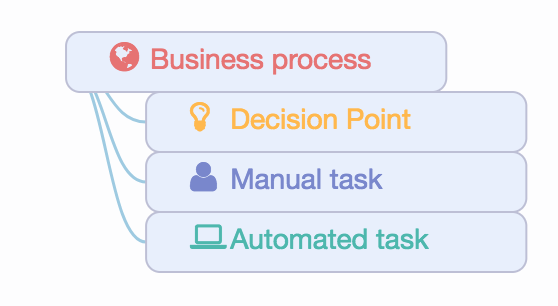
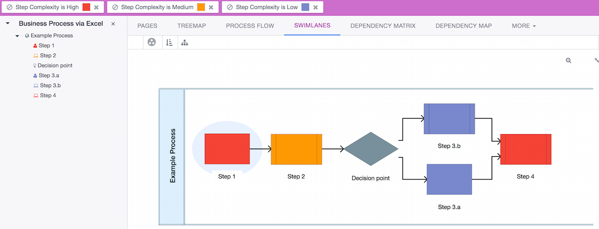

This utility imports data from Excel into Ardoq.

See [./examples/business_process/business_process.xlsm](./examples/business_process/business_process.xlsm?raw=true) for an example Excel format we can use for importing.
The file also contains a VBA script for automatically generating references that can be used as a starting point.

## Execution
You must configure your authentication token and set the environment variable `ardoqToken` and `organization` in your environment, or specify it in the properties file.

After you have downloaded this project you can execute the example with the following command (remember to configure your api-token and organization first):

```java -Dfile.encoding=UTF-8 -classpath "build/ardoq-excel-import-1.1.jar" com.ardoq.ExcelImport ./examples/business_process/business_process.properties```

If you only need the binary you can download [the Überjar](./build/ardoq-excel-import-1.1.jar?raw=true) 

## Example

The included example file [./examples/business_process/business_process.xlsm](./examples/business_process/business_process.xlsm?raw=true) show how you can import a small process into the default Business Process template.



After importing the example file, Ardoq will automatically generated visualizations, for example this Swimlane view.



## Configuration

The default.properties file shows how to configure it:
```=ini
#The authentication token to use (Generate a new one via your profile - Click on your name in Ardoq, Profile and Prefs -> API and Tokens)
ardoqToken=<your api token>

#The Ardoq host (default is https://app.ardoq.com
ardoqHost=https://app.ardoq.com

#Name of the workspace to synchronize to
workspaceName=excelImport

#The model name you wish to use. (You can find the available models here https://app.ardoq.com/api/model?includeCommon=true?org=<your organization label>)
modelName=Application Service

#The organization label (You'll find this in the API-token tab under your settings)
organization=<your organization label>

#Deletes components and references not found in spreadsheet if set to YES
deleteMissing=NO

#ComponentFile is the excel file with components
componentFile=./src/main/resources/data.xlsx

#component sheet is the name of the spreadsheet with components to load
componentSheet=Application list

#The name of the columns that you wish to map to a page type in the model.
compMapping_System=Application
compMapping_Application=Service

#If you have multiple leaf types in your model, you can use a separate column to specify the type (see .examples/business_process for an example)
#dynamicCompMapping_TypeMapping=Service

#The name of the column that has the descriptions
compDescriptionColumn=General description

#The name of the columns you wish to map to a field in the model. You can have as many column/field mappings as you want.
#Please escape whitespace, colon and equal characters with \ (backslash)

fieldColMapping_TAM\ Mapping=tam_mapping
fieldColMapping_Criticality=criticality
fieldColMapping_Category=category

#Reference File is the excel file with references (can be the same as component file)
#If you do not wish to import references, please comment it out with #
referenceFile=./src/main/resources/data.xlsx

#Component page separator for source and target page references.
referenceComponentSeparator=::

#Referencesheet is the name of the spreadsheet that has the references
referenceSheet=References
#Which row the references start from (set it to 1 if you have header row)
referenceStartFromRow=1
#Which column has the source reference in the format ParentPage::ChildSourcePage
referenceSourceColumn=0
#The column that contains the link type, set it to -1 if no column is available
referenceLinkTypeColumn=1
#The default link type from the model that you wish to use, if no value is present in LinkTypeColumn, or you do not have any
referenceDefaultLinkType=Synchronous
#The column that contains the references, you can have many target pages in one column, with comma separated values.
referenceStartFromColumn=2
```
